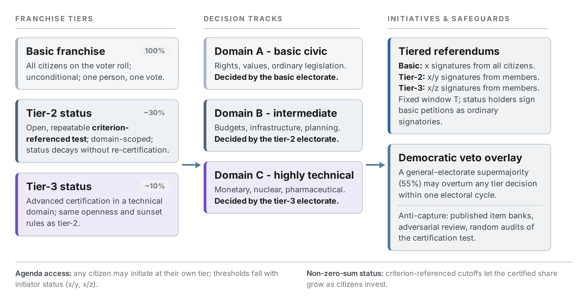

# Laminar Democracy

**A tiered direct-democracy design with adaptive epistemic friction: paper and reproducible agent-based simulation.**

[](https://github.com/snowflake-amiya/laminar-democracy/actions/workflows/ci.yml)
[](LICENSE)
[](https://creativecommons.org/licenses/by/4.0/)

> CI re-runs all six experiments on every push and **asserts the results match
> the paper within 1e-6**. Seed-deterministic; verified bit-exact on the pinned
> dependency stack. If the badge is green, the numbers in the paper are the
> numbers this code produces.

## What this is

Laminar Democracy is a design for direct democracy in which voting friction is
calibrated to the cognitive demands of the issue at hand ("adaptive epistemic
friction"):

- **Tier 1: basic democracy.** All citizens vote on foundational,
  values-based questions (rights, constitutional change, war and peace).
- **Tier 2 / Tier 3: civic standing.** Technical or specialized domains
  (monetary policy, epidemiological measures, infrastructure engineering) are
  decided by citizens who have earned domain-specific standing through open,
  auditable assessment.

Standing is earned, not bought or inherited: the item bank is public,
authorship is adversarially reviewed, items are randomly audited against
population outcomes, and all standing expires and must be re-earned
(sunset clauses). Every tier decision remains reversible by a universal
supermajority veto, so basic democracy stays sovereign at every layer, which is
what makes the flow *laminar* rather than *stratified*.

Anyone may propose a referendum. Signature thresholds to qualify an issue are
lower within tiers (where each signature carries more verified competence),
but the universal track is always open.

## Headline simulation results

Agent-based simulation, N = 2,000 citizens, seed 20261003, six experiments
(E1–E6) comparing plain direct democracy (DD), two-tier (T2), three-tier (T3),
and sortition assemblies (SORT):

| Metric | DD | T2 | T3 | Sortition |
|---|---|---|---|---|
| Welfare (issue-mix weighted accuracy) | 0.825 | 0.989 | **0.996** | 0.909 |
| Accuracy on hard technical domain (C) | 0.536 | 0.954 | **0.992** | 0.715 |

- **The pre-registered decision rule:** the three-tier design was to be adopted
  *only if* it is not dominated by the best two-tier variant. It is preferred:
  the T3-over-T2 welfare advantage is positive at every test-validity level and
  largest precisely when assessment is noisy (v = 0.3: +1.5 pts welfare,
  +7.6 pts domain-C accuracy).
- The raw tier-3 referendum rule (z = 2) starves the agenda (0.8% qualification
  rate); the paper recommends the adjusted rule (z = 5).
- Tiered layers are near-immune to mass-persuasion capture; the universal veto
  collapses bribery-style capture of experts.
- Under standing-acquisition incentives, the share of standing holders grows
  from 31% to 47%: the franchise is non-zero-sum.

Full results: [`sim/results/`](sim/results/) · Figures: [`figures/`](figures/) ·
Paper: [`paper/laminar-democracy-white-paper.pdf`](paper/laminar-democracy-white-paper.pdf)



## Repository layout

```
paper/      the white paper (PDF)
sim/        simulation code + committed reference results
  sim_core.py          agent-based model core
  run_experiments.py   experiments E1-E6 (writes sim/results/)
  verify_results.py    CI assertion against published numbers
  make_charts.py       regenerates the paper's figures
figures/    the seven figures used in the paper
```

## Quickstart

```bash
pip install -r requirements.txt
python sim/run_experiments.py     # ~3 min, writes sim/results/
python sim/verify_results.py      # asserts match with the paper
python sim/make_charts.py         # regenerates figures into sim/figs/
```

Requires Python 3.10+. The architecture diagram additionally needs Playwright
(`sim/shoot_diagram.py`); everything else is plain numpy/scipy/matplotlib.

## Reproducibility

Every experiment runs from a single fixed seed (`20261003`). Results were
verified **bit-exact** on numpy 2.1.3 / scipy 1.14.1 / matplotlib 3.9.2, and
the CI job asserts all headline numbers within 1e-6 on every push. If you
observe drift on another platform, please open an issue. Numerical drift on a
new platform is worth knowing about, and we track it here.

## Discussion & objections

Structured criticism is welcome and expected. Issue templates cover the three
major anticipated objections (literacy-test disempowerment, the
boundary/classification problem, and Hong–Page diversity loss); please use
them, and link the paper section you are challenging. Open debate and
questions belong in
[Discussions](https://github.com/snowflake-amiya/laminar-democracy/discussions).

## Roadmap

- [ ] Shadow pilot: replay historical referendum datasets (e.g., Swiss federal
      votes) through the model and publish counterfactual tier assignments.
- [ ] Test-bank governance spec (adversarial authorship, random audit
      procedure, sunset/re-certification cadence).
- [ ] DAO pilot: implement the signature-threshold rules as on-chain
      governance and compare against observed Snapshot/Governor outcomes.

## Citation

```bibtex
@misc{amiya2026laminar,
  author = {S. Amiya},
  title  = {Laminar Democracy: A Design and Simulation Study of Tiered
            Direct Democracy with Adaptive Epistemic Friction},
  year   = {2026},
  publisher = {GitHub},
  url    = {https://github.com/snowflake-amiya/laminar-democracy}
}
```

## License

- **Code** (everything in `sim/`): [MIT](LICENSE)
- **Paper and figures** (`paper/`, `figures/`):
  [CC BY 4.0](https://creativecommons.org/licenses/by/4.0/)
